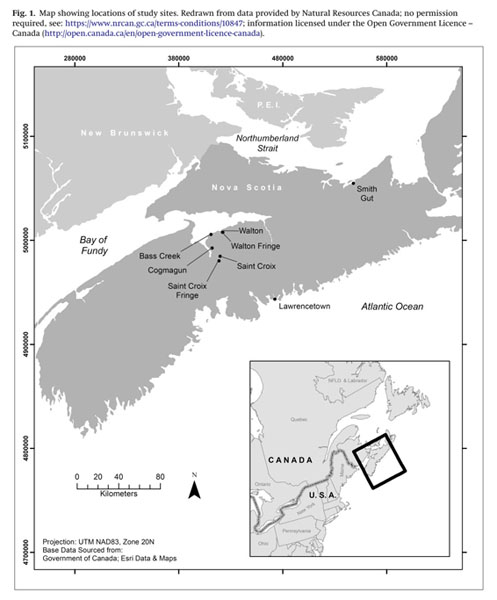
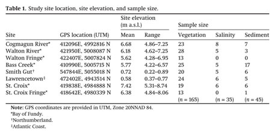

Nichols_Assignment 5
Link: https://github.com/kaileynichols/Nichols_Assignment5.git 

Porter, C., Lundholm, J., Bowron, T., Lemieux, B., Van Proosdij, D., Neatt, N., & Graham, J. (2015). Classification and environmental correlates of tidal wetland vegetation in Nova Scotia, Canada. Botany, 93(12), 825-841.

##Introduction

Tidal wetlands are some of the most valuable coastal ecosystems globally as they offer a vast array of ecosystem services. Despite their significance, developmental pressures such as the influx of dyke infrastructure in Europe and North America have resulted in a 70% loss of historical salt marsh area. As a result, it is critical to develop a more thorough quantitative classification and description of ecological conditions of tidal wetlands to inform restoration projects as sea level rise poses impending threats to these globally significant ecosystems. This study aims to classify tidal wetland vegetation in NS and to determine the environmental influences associated with plant community composition in order to better understand the environmental factors and vegetation-environment relationships of tidal wetlands in Eastern Canada.

##Methods

Eight study sites were selected to represent the Bay of Fundy Region, the Atlantic Coast, and the Carboniferous Lowlands of the Gulf of St. Lawrence/Northumberland Strait Region (Figure 1). These sites serve as reference sites for restoration projects in the region. Vegetation surveys were performed at each of the sites throughout July and August using the transect plot sampling method to maintain the same geographic location of the plots each year which spanned from the upland edge to the discrete toe of the slope. This included a point intercept method to determine species abundance and composition within the quadrats (25 grid squares, 20cm x 20cm), which confirmed the stability of the sites over time. 

Environmental variables including plot elevations, interstitial porewater salinity, and sediment cores were also assessed. Plot elevations were collected on all sample plots with a Trimble R8 GNSS RTK GPS surveying system (Figure 2). This survey data was used to analyze the elevations associated with tidal range, hydroperiod, inundation frequency, and mean inundation time. Interstitial porewater salinity was collected three times during low tide using a soil probe slipper in July, August, and September. These samples were taken on vegetation stations representative of tidal and elevation ranges of each sampled marsh and were manipulated to provide a single, mean salinity value for each location. Sediment cores were also collected to provide data on bulk density and loss of ignition (LOI) of organic material.

Various statistical analyses were then performed including a redundancy analysis and a floristic cluster analysis,to assess multivariate relationships in plant species composition.

```{r, echo=FALSE, fig.cap="Map showing locations of study sites", out.width = '100%'}


```
```{r, echo=FALSE, fig.cap="Table of Study site location, site elevation and sample size", out.width = '100%'}


```

##Results and Conclusion


